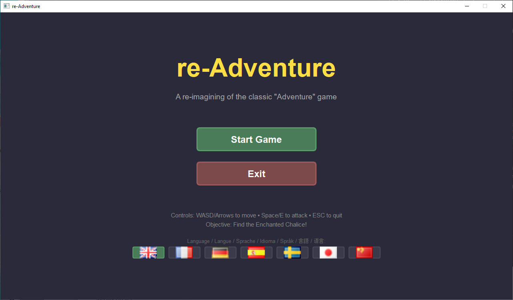
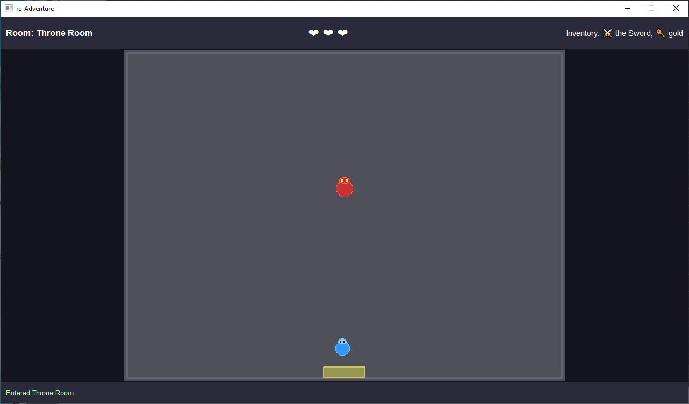

# re-Adventure

A re-imagining of the classic "Adventure" game, built with Python 3 and PyQt6.




## Features

- Top-down adventure gameplay
- Connected room-based world
- Inventory system (keys, sword, quest items)
- Dragon enemies with AI
- Simple combat system
- Room transitions
- Save/Load functionality
- 1280x720 desktop window
- **Multi-language support** - Choose from 7 languages in the main menu

## Supported Languages

The game supports the following languages (selectable from the main menu):

- 🇬🇧 **English** (default)
- 🇫🇷 **French** (Français)
- 🇩🇪 **German** (Deutsch)
- 🇪🇸 **Spanish** (Español)
- 🇸🇪 **Swedish** (Svenska)
- 🇯🇵 **Japanese** (日本語)
- 🇨🇳 **Chinese** (中文)

Your language preference is automatically saved and will be remembered for future game sessions.

## Installation

1. Install Python 3.x (if not already installed)
2. Install dependencies:

```bash
pip install -r requirements.txt
```

## Running the Game

```bash
cd re-Adventure
python main.py
```

## Controls

- **WASD** or **Arrow Keys**: Move
- **Space** or **E**: Attack (requires sword)
- **ESC**: Quit game

## Objective

Explore the castle, forest, dungeon, and labyrinth to find the **Enchanted Chalice**!

- Find the **Sword** to defeat dragons
- Collect **Keys** to unlock doors (future feature)
- Avoid or defeat **Dragons** and other enemies
- Manage your **Health** (3 hearts)

## Game World

The game features 15 interconnected rooms:
- **Castle** area (entrance, great hall, throne room, armory, library)
- **Forest** area (training grounds, forest edge, deep forest, dark cave)
- **Dungeon** area (courtyard, dungeon entrance, dungeon depths)
- **Labyrinth** area (start, north, south)

## Development

### Project Structure

```
re-Adventure/
  main.py              # Entry point
  app/                 # UI components
    main_window.py     # Main window and game loop
    game_view.py       # Game rendering (QGraphicsView)
    ui_panels.py       # HUD panels (health, inventory, messages)
  engine/              # Game engine
    world.py           # World and Room classes
    entities.py        # Entity classes (Player, Enemy, Item, Hazard)
    systems.py         # Game systems (Movement, Collision, Combat)
    state.py           # Game state management
  data/                # Game data
    rooms.json         # Room definitions
    items.json         # Item definitions
    enemies.json       # Enemy definitions
    scripts.json       # Dialog/message scripts
    saves/             # Save game files
```

### Tech Stack

- **Python 3.x**
- **PyQt6 v6.10** - UI framework
- **QGraphicsView** - 2D rendering
- **JSON** - Data storage

### Future Features

- Level editor
- More enemy AI behaviors
- Puzzle mechanics
- More Audio
- Minimap
- Multiple save slots
- Randomized items/enemies

## Audio

game audios are from pixabay.com


## License

This is a fan project and educational exercise.

